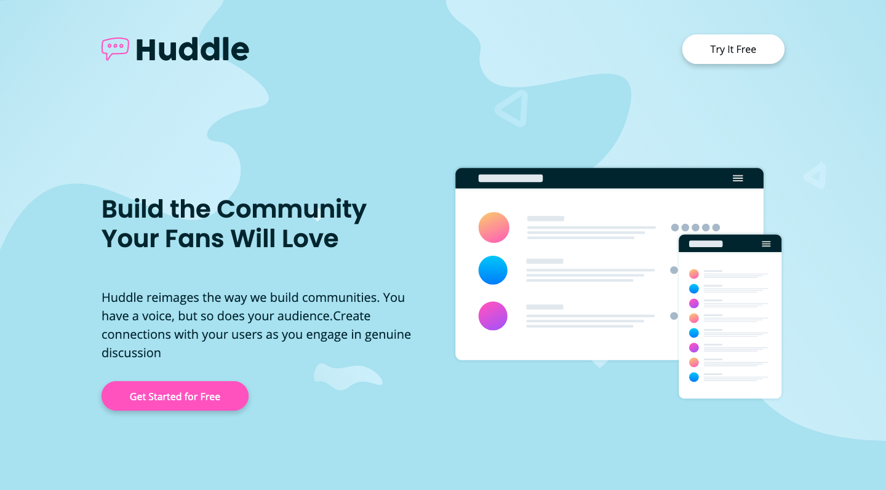

## Huddle Landing Page

This is a self-started project, inspired by [this](https://www.frontendmentor.io/challenges/huddle-landing-page-with-alternating-feature-blocks-5ca5f5981e82137ec91a5100) Frontend Mentor challenge. - I used the free design in .jpg as a guide and the available logo and image assets.

Technology used:

- HTML
- Bootstrap
- css/Sass
- npm
- AOS library
- Git

Tools used:

- Atom
